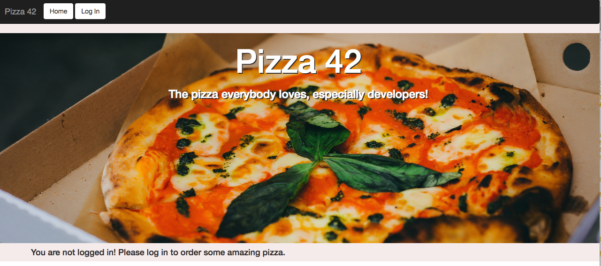

# Auth0 JavaScript Build out For Pizza 42 

#Calling an API

This sample demonstrates how to make secure calls to an API after authenticating a user with Auth0. The calls to the API are made with the user's `access_token` and at the moment utilizes a fake online REST API for testing from https://jsonplaceholder.typicode.com/. After a user is logged in and clicks order pizza they will recieve an alert notifying them that the request is recieved and a JSON object will be sent back. 

## Getting Started

# To Run it Locally

- npm install

- npm start

- The application will be served at `http://localhost:3000`.

# Auth0 Addtional Account Setup Settings
- This account is set up with 'Force Email Verifcation' 
- After signing up a user recieves an email notification and must click accept for it to be verified 
- It has also been paired with Google People API 

# Hosting
If the deployment works it should be hosted at either https://tbricca.github.io/pizza42-auth0/ or at http://pizza42-42auth0.herokuapp.com/ 

## Author

[Auth0](https://auth0.com)

## License

This project is licensed under the MIT license. See the [LICENSE](LICENSE.txt) file for more info.

